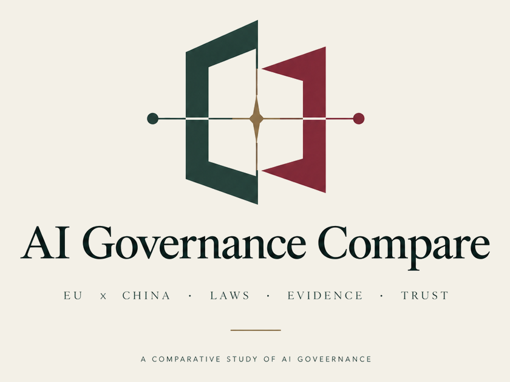

<p align="center">
  
</p>

<p align="center">
  <a href="https://github.com/modusensus/ai-governance-compare/actions/workflows/validate.yml"></a>
  
  
  
  
  <a href="CITATION.cff"></a>
  
  
  
</p>

**A source-traceable comparison of how the EU and China regulate AI and data.** Each comparison answers one question — how must AI-generated content be labelled, how may personal data cross a border, who is liable when AI causes harm — and every key claim carries an evidence grade and the date it was last checked.

**中文**：欧盟与中国如何监管 AI 与数据的**可溯源对照** —— 一份对比回答一个法律问题，每条关键主张都标注**证据等级**与**最后核查日期**。中文入口：[总览](docs/compare/00-overview-zh.md) · [AI 标识](docs/compare/01-ai-labeling-zh.md) · [数据出境](docs/compare/03-cross-border-data-zh.md)。

> **Principle: nothing enters this repository without a source.**

## Start here

| Question | Comparison |
|---|---|
| How must AI-generated content be labelled? | [01 — Labelling regimes](docs/compare/01-ai-labeling.md) |
| How may personal data be processed, and how does it cross borders? | [02 — Personal data](docs/compare/02-personal-data.md) |
| When may data leave the country? | [03 — Cross-border data](docs/compare/03-cross-border-data.md) |
| What is a platform responsible for? | [04 — Platform responsibility](docs/compare/04-platform-responsibility.md) |
| Who pays when AI causes harm — and what is still coming? | [05 — Liability and pending law](docs/compare/05-liability-and-pending-law.md) |
| Who may use, and must protect, the data and systems underneath AI? | [06 — Data and infrastructure](docs/compare/06-data-and-infrastructure.md) |

Want the whole picture first? Read the [overview](docs/compare/00-overview.md).

## What this is

- One file per law, under `docs/eu/` and `docs/cn/`.
- Cross-jurisdiction comparisons under `docs/compare/`, organised by **question** — how is AI-generated content labelled? how does personal data cross borders? who is liable? — not by statute list.
- Every key fact carries an **evidence grade** and a **last-verified date**.

## What this is not

- Not legal advice, and not a compliance opinion you can rely on.
- Not a home for claims without an official source.

## How to read

1. Start with [`docs/compare/00-overview.md`](docs/compare/00-overview.md) for the big picture.
2. Then read the topical comparison you need under `docs/compare/`.
3. Go into `docs/eu/` or `docs/cn/` for single-law cards.

## Evidence grades

| Grade | Meaning | Can it support a conclusion? |
|---|---|---|
| **A** | Primary official text — statute, regulation, agency rule, official guidance | Yes |
| **B** | Official interpretation or authoritative secondary source — government white paper, official legal database | Explanatory support only |
| **C** | Media, commentary, blog posts | Background only |

Conclusions should rest on grade A. Grade B may explain; grade C may only set context.

## Layout

```
docs/
├── README.md          # reading guide and writing rules
├── eu/                # EU: AI Act, GDPR, DSA/DMA, …
├── cn/                # China: PIPL, DSL, CSL, generative-AI measures, labelling measures, …
└── compare/           # cross-jurisdiction comparisons, one question per file
    ├── 00-overview.md
    ├── 01-ai-labeling.md
    ├── 02-personal-data.md
    ├── 03-cross-border-data.md
    ├── 04-platform-responsibility.md
    ├── 05-liability-and-pending-law.md
    └── 06-data-and-infrastructure.md
skills/
└── ai-governance-compare/   # the same content, loaded as an agent skill
assets/
└── logo.png                 # the mark above
```

## Language

**English is the default.** A translation lives next to its source file with a language suffix — today `-zh.md` for Chinese. Translations are welcome; they are not required for a contribution to be merged.

## Related work

Other open projects in this space, listed as discovery aids. This is the one section where we describe other people's projects rather than primary sources. What we check is **what each project is and how it records its sources** — we do not audit whether its legal analysis is correct, and we do not restate or vouch for its claims. A row that says how a project sources itself is a structural observation about the repository, not a judgement on its accuracy. For anything that matters, go to the official text (see the `source` field on each card).

| Project | What it is | How it differs from this repository |
|---|---|---|
| [awesome-artificial-intelligence-regulation](https://github.com/EthicalML/awesome-artificial-intelligence-regulation) | A curated index of AI guidelines, principles, ethics codes, standards and regulation, grouped by jurisdiction | An index answers "where do I find it". This repository answers "what does the rule say, and how do the two sides differ", with each claim graded against the official text. |
| [awesome-ai-governance](https://github.com/agentrust-io/awesome-ai-governance) | A curated index of some 180 tools, specifications and resources for governing AI agents, with links re-checked by CI (CC0) | Agent-runtime tooling rather than legal sources — the few AI Act entries point at products that reference the Act, not at the Act itself. |
| [university-ai-policy-tracker](https://github.com/SciWhite/university-ai-policy-tracker) | Tracks university AI policies worldwide; each claim carries a source URL, a verbatim quote and a content hash, and is re-checked against the live page on a schedule (Apache-2.0) | Closest to our *method*. Different subject — institutional policy, not national law — and its evidence tiers describe the retrieval channel (page, PDF, archive) rather than the legal weight of a source. |
| [ai-policy-tracker](https://github.com/hayleyamay/ai-policy-tracker) | A scheduled tracker that pulls UK policy papers, US Congress bills and EU AI Act implementation documents daily and adds a model-written plain-English summary to each record (MIT) | Closest to our *scope*, but it follows legislative status over time rather than comparing provisions. Summaries are generated from each record's title and description, and the EU leg reads a third-party tracker rather than EUR-Lex. |
| [Privacy-Data-Protection-Skills](https://github.com/mukul975/Privacy-Data-Protection-Skills) | 282 privacy and data-protection references packaged as agent skills, spanning GDPR, CCPA, the EU AI Act, HIPAA, LGPD, PIPL and India's DPDP Act (Apache-2.0) | Overlaps our subject matter, and is built to be loaded by an agent rather than read against a statute. Skills name articles but carry no links to primary text, so their claims cannot be re-verified. |
| [verifywise](https://github.com/verifywise-ai/verifywise) | A self-hosted governance platform shipping the EU AI Act, ISO 42001, NIST AI RMF and some twenty other frameworks as built-in control checklists (TypeScript and Python) | It runs a compliance programme — an organisation works through its lists. We describe what the statute requires and cite it. Note the licence: Business Source License 1.1 is free for internal use only and is not an open-source licence; check it before reusing anything. |
| [EuConform](https://github.com/Hiepler/EuConform) | An EU AI Act risk-classification and bias-testing tool that returns article references alongside each result (TypeScript; MIT) | One jurisdiction, and it classifies the system you describe rather than comparing what two legal orders require of it. |
| [attestix](https://github.com/VibeTensor/attestix) | Identity and attestation infrastructure for AI agents — decentralised identifiers, verifiable credentials, delegation chains, and a compliance layer that records an organisation's own risk assertions (Python; Apache-2.0) | Its records are cryptographically signed rather than cited: a signature tells you a claim has an author, not that it matches the statute. |
| [finOS AI Governance Framework](https://github.com/finos/ai-governance-framework) | A financial-services community specification: risk and mitigation cards plus a crosswalk of roughly a thousand references into EU AI Act, NIST, FFIEC, FCA and OSFI material (CC BY 4.0) | An industry practice map — how institutions turn obligations into controls. Cards carry a document status but no per-claim source grade or verification date, so read it as background, not as law. |

Maintain a project that belongs here? Open an issue — we add entries only after checking what the project actually is.

## Use it from an agent

Nothing to install. Paste this into your agent — Claude Code, Codex, Cursor, or any chat that can read a URL — and ask your question in the same session:

```
Read https://cdn.jsdelivr.net/gh/modusensus/ai-governance-compare@main/skills/ai-governance-compare/SKILL.md and follow it: for any question about how the EU or China regulates AI and data, answer from https://github.com/modusensus/ai-governance-compare, never from memory, and cite the official source, the evidence grade and the date each claim was checked.
```

The same file is served at `https://raw.githubusercontent.com/modusensus/ai-governance-compare/main/skills/ai-governance-compare/SKILL.md`. The line above goes through a CDN mirror, which stays reachable from networks that reset the raw domain.

Then, for example:

> How must AI-generated content be labelled in the EU and in China?

That line is the whole install. What it fetches is a short instruction sheet, not the content: it tells the agent where to look, how to pull a claim out with its source and grade, and what to do when the repository does not cover the question — say so rather than improvise. Nothing in it needs updating when a comparison is added.

**Want it to load by itself?** Copy the same file into your agent's skills directory — the paths are in [`skills/ai-governance-compare/README.md`](skills/ai-governance-compare/README.md).

## Contributing

See [CONTRIBUTING.md](CONTRIBUTING.md). In one line: **one law per file, link the official source, grade the evidence, date the check.**

By participating you agree to the [CODE_OF_CONDUCT.md](CODE_OF_CONDUCT.md).

## License

- **Documents** (`docs/`, `skills/`, `assets/` and all prose): [CC BY-SA 4.0](LICENSE-docs)
- **Code and scripts**: [MIT](LICENSE)

## Disclaimer

This is a public knowledge base, **not legal advice**. Laws change; always confirm against the official text, and check the `verified` date on the card you are reading.
